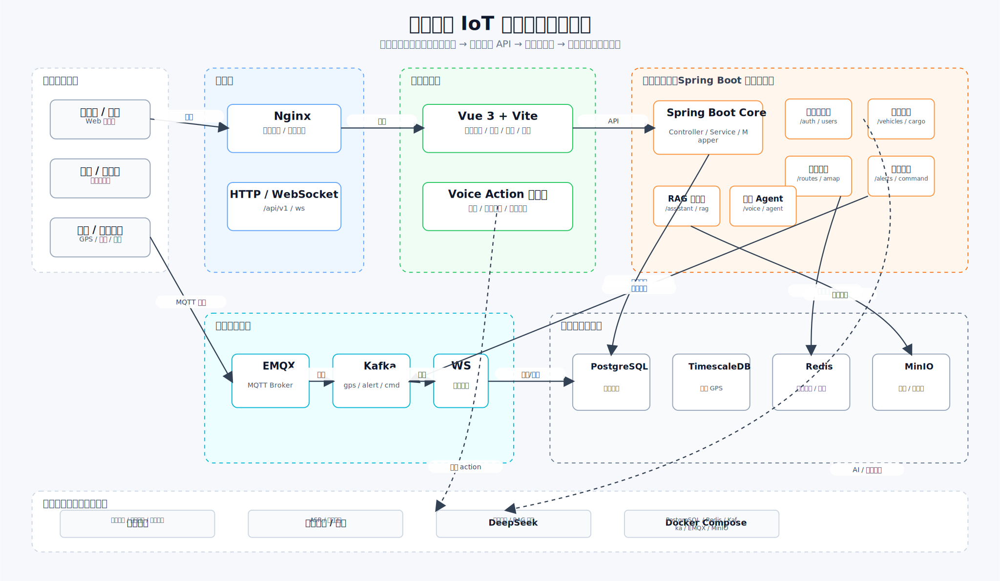
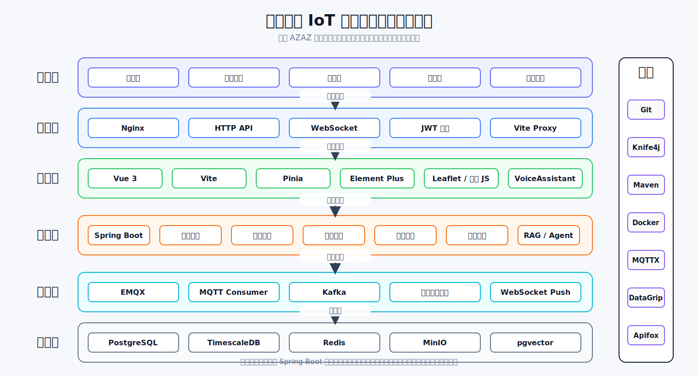

# 智慧物流 IoT 平台顶层设计

> 版本：v0.1 草稿  
> 更新时间：2026-07-10  
> 对应主库目录：`smart-logistics-ui/`、`sky-take-out/sky-server/`

---

## 1. 架构图草稿



这张图参考 AZAZ 项目的系统架构图表达方式，但只保留智慧物流当前最重要的主链路：用户访问、前端运营台、后端业务 API、MQTT/Kafka 实时链路、数据存储和外部智能能力。图中刻意减少跨区箭头，避免把所有接口和模块塞进一张图里。

---

## 2. 顶层技术选型分层图



这张图参考 AZAZ 的顶层模块设计图，按用户层、接入层、前端层、应用层、实时层、数据层和工具列拆分。当前后端是一个 Spring Boot 模块化单体，图中的应用层模块表达代码和职责边界，不按未落地的微服务形态虚构拆分。

两张图都由 [`generate_architecture_diagrams.py`](./generate_architecture_diagrams.py) 生成，后续改技术选型、层级或模块名时优先改脚本后重新生成 SVG。

---

## 3. 顶层目标

智慧物流平台要解决的是“车、货、设备、调度、告警、智能问答”的统一运营问题。顶层设计围绕五个闭环：

| 闭环 | 目标 |
|---|---|
| 运输可视化闭环 | GPS 上报后，前端地图实时看到车辆位置、轨迹、ETA 和货物状态。 |
| 调度指令闭环 | 调度员下发改道/通知，后端落库并通过 MQTT 发到车机，回执后前端更新。 |
| 告警处理闭环 | 离线、偏航等异常被检测、去重、推送、确认、关闭并留痕。 |
| 智能交互闭环 | 用户通过语音或文本生成结构化 action，前端执行跳转、定位、弹窗或调用接口。 |
| 知识问答闭环 | 文档进入 MinIO 和 pgvector，DeepSeek 基于检索结果回答运营问题。 |

---

## 4. 分层设计

### 4.1 用户层

用户层覆盖货主、调度员、仓管、司机、管理员。不同角色看到不同菜单，但统一使用同一个 Vue 前端：

| 角色 | 主要页面 |
|---|---|
| 货主 | 货物追踪、智能问答 |
| 调度员 | 车辆调度、货物追踪、告警中心、人员管理 |
| 仓管 | 仓储管理、设备在线、告警中心 |
| 司机 | 司机任务、指令执行 |
| 管理员 | 全量运营视图和配置能力 |

### 4.2 接入层

接入层由 Nginx 和 HTTP/WebSocket 入口组成：

- Nginx 承载前端静态资源、反向代理 `/api/v1` 和 WebSocket。
- HTTP API 使用统一响应格式：`code/message/data/timestamp/requestId`。
- WebSocket 统一推送车辆位置、告警、指令回执等实时事件。
- 登录态使用 JWT；前端保存 accessToken/refreshToken，后端负责登录、刷新和当前用户解析。

### 4.3 前端应用层

前端主项目是 `smart-logistics-ui/`：

| 模块 | 职责 |
|---|---|
| `src/services/*` | 统一封装 Axios、token、接口类型、WebSocket、MQTT 客户端。 |
| `src/stores/logistics.ts` | 全局业务状态：车辆、货物、告警、设备、用户、通知。 |
| `src/views/*` | 运营总览、货物追踪、车辆调度、仓储、告警、司机任务、智能问答。 |
| `src/components/SmartMap.vue` | 地图呈现与车辆定位，监听 Agent 地图定位事件。 |
| `src/components/VoiceAssistant` | 录音、上传 `/voice/command`、执行后端 action。 |
| `src/utils/actionExecutor.ts` | 前端 Action 执行器，负责跳转、地图定位、确认弹窗、调用接口。 |

前端执行原则：

- 后端 Agent 只返回结构化 action，不直接操控页面。
- 页面跳转、地图聚焦、弹窗和确认后的业务 API 调用都由前端执行。
- 危险操作必须二次确认，例如下发改道指令。

### 4.4 应用服务层

后端主项目是 `sky-take-out/sky-server/`，当前采用单体 Spring Boot 模块化实现：

| 模块 | 主要接口/职责 |
|---|---|
| 认证与用户 | `/auth/login`、`/auth/face-login`、`/users/me`、人脸绑定。 |
| 车辆与货物 | `/vehicles`、`/cargo`、车辆货物绑定、状态更新。 |
| 路线与地图 | `/routes/*`、`/amap/*`、高德路线规划、地理编码、偏航检测。 |
| 告警中心 | `/alerts`、告警生成、确认、关闭、日志。 |
| 调度指令 | `/vehicles/{plate}/command`、指令落库、MQTT 发布、回执处理。 |
| 设备在线 | `/devices/status`、心跳缓存、离线检测。 |
| 智能问答 | `/assistant/chat`、知识库文档、RAG、DeepSeek 调用。 |
| 语音 Agent | `/voice/command`、`/agent/command`、ASR、意图解析、action 生成。 |

### 4.5 实时与设备链路

实时链路的主路径是：

```txt
车载终端
  → MQTT: vehicle/{vin}/gps 或 vehicle/{vin}/heartbeat
  → EMQX
  → Spring Integration MQTT Consumer
  → Kafka: gps-points / vehicle-heartbeats
  → Kafka Consumer
  → TimescaleDB 保存历史点位
  → Redis 保存最新位置/心跳
  → WebSocket 推送给前端
```

调度指令的反向路径是：

```txt
前端确认调度指令
  → POST /vehicles/{plate}/command
  → commands / command_logs 落库
  → MQTT: vehicle/{vin}/command
  → 车载终端执行
  → command/ack 回传
  → 前端 WebSocket 更新执行状态
```

### 4.6 数据层

| 组件 | 当前用途 |
|---|---|
| PostgreSQL | 用户、车辆、货物、绑定、告警、指令、人脸绑定、语音日志等业务数据。 |
| TimescaleDB | GPS 点位、设备心跳等时序数据。 |
| Redis | 最新位置、最新心跳、告警去重、token 黑名单、短期状态缓存。 |
| Kafka | GPS、心跳、告警、指令等事件缓冲和解耦。 |
| MinIO | 运单附件、知识库文档、图片等对象文件。 |
| pgvector | 知识库 chunk embedding，用于 RAG 检索。 |

---

## 5. 核心链路设计

### 5.1 登录与人脸登录

```txt
账号密码登录：
前端 → POST /auth/login → JWT + 用户信息 → 初始化业务数据

人脸登录：
摄像头截图 → imageBase64 → POST /auth/face-login
  → 百度人脸检索/本地演示兜底
  → face_login_logs 记录
  → JWT + 用户信息 + face 匹配信息
```

设计边界：

- 前端负责摄像头采集和 base64 编码。
- 后端负责人脸比对、用户映射、登录日志和 token 签发。
- 百度 Key 未配置时使用演示兜底，只用于本地联调。

### 5.2 语音 Agent Action

```txt
点击 VOICE 按钮
  → 浏览器录音并转 16k mono WAV
  → POST /voice/command
  → 百度 ASR 转文本
  → Agent 生成 action
  → 前端 executeAgentAction(action)
```

Action 类型：

| 类型 | 前端行为 |
|---|---|
| `NAVIGATE` | 检查路由白名单后跳转页面。 |
| `HIGHLIGHT_MAP_TARGET` | 派发地图事件并定位车辆。 |
| `OPEN_MODAL` | 打开指定弹窗或帮助窗口。 |
| `SHOW_RESULT` | 展示查询结果或跳转到对应业务视图。 |
| `CALL_API` | 先弹确认框，再调用后端白名单接口。 |
| `NOOP` | 提示暂无可执行操作。 |

安全约束：

- 路由跳转必须命中 `routeWhiteList`。
- `CALL_API` 必须二次确认。
- 调度类接口后续应在后端补强角色权限和 API 白名单校验。

### 5.3 偏航与离线告警

```txt
GPS / 心跳进入 Redis
  → 定时任务读取最新状态
  → RouteDeviationDetector / DeviceOfflineDetector
  → AlertService 去重和落库
  → WebSocket alert.triggered 推送前端
  → 调度员确认/关闭
  → alert_logs 留痕
```

### 5.4 RAG 智能问答

```txt
上传知识文档
  → MinIO 保存原文件
  → 文档切分为 chunks
  → Embedding 写入 pgvector
  → 用户提问
  → 向量检索相关 chunks
  → DeepSeek 生成答案
  → 前端 Markdown 安全渲染
```

---

## 6. 部署视图

本地开发推荐：

| 组件 | 运行方式 |
|---|---|
| 前端 | `cd smart-logistics-ui && npm run dev` |
| 后端 | `mvn -f sky-take-out/sky-server/pom.xml spring-boot:run` |
| PostgreSQL / TimescaleDB / Redis / Kafka / EMQX / MinIO | `docker-compose.yml` |

生产/演示部署建议：

```txt
Nginx
  ├── /              → 前端 dist
  ├── /api/v1        → Spring Boot
  └── /api/v1/ws     → Spring Boot WebSocket

Spring Boot
  ├── 业务 API
  ├── MQTT Consumer/Publisher
  ├── Kafka Consumer
  ├── 定时检测任务
  └── RAG/AI 外部服务调用
```

---

## 7. 当前实现与后续演进

### 已落地

- 前端源码已进入主库 `smart-logistics-ui/`。
- 后端 API、MQTT、Kafka、Redis、TimescaleDB、MinIO、RAG、语音、人脸能力已按当前文档接入。
- 语音 Action 执行器支持页面跳转、地图定位、确认弹窗、真实业务接口调用。
- `public/active-theory` 作为门户视觉资源纳入主库，大文件通过 Git LFS 管理。

### 建议下一步

| 优先级 | 事项 |
|---|---|
| P0 | 后端 `CALL_API` 白名单与角色权限从“一期宽松”改成强校验。 |
| P0 | 增加统一启动说明：数据库初始化、docker-compose、前后端环境变量。 |
| P1 | 把 GPS/告警/指令链路做成自动化联调脚本。 |
| P1 | 给语音 Agent 增加同义词/模糊匹配配置表，降低口音和识别误差影响。 |
| P2 | 若后续并发上升，再把实时链路、RAG、认证拆成独立服务。 |

---

## 8. 设计原则

1. **结构化 action 优先**：Agent 不直接执行业务动作，只返回可审计、可确认、可白名单校验的 action。
2. **实时链路与业务链路解耦**：GPS/心跳通过 MQTT + Kafka 入流，业务 API 不阻塞设备上报。
3. **冷热数据分层**：业务数据进 PostgreSQL，时序数据进 TimescaleDB，最新状态进 Redis。
4. **关键操作可追踪**：告警、指令、人脸登录、语音命令都要落日志。
5. **前端只做体验执行层**：页面跳转、地图定位、弹窗由前端负责；权限和数据可信性由后端兜底。
