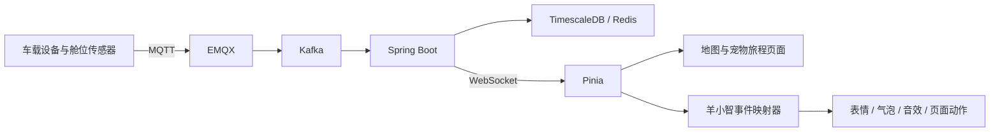

# DESIGN.md — 萌宠安心运输桌宠「羊小智」

> 产品：萌宠安心运输平台  
> 桌宠：羊小智（Yang Smart）  
> 目标：将现有智慧物流 IoT 平台升级为面向猫、犬、兔、鸟类等小动物的专业运输与在途照护平台。

---

## 1. 产品定位

**一句话：让宠物主人看得见运输过程，让调度与照护人员及时发现风险，让每一只小动物都被安全、温柔地送达。**

平台从“货物运输”升级为“宠物旅程管理”，核心对象调整为：

- 宠物旅客
- 运输笼位
- 萌宠运输车辆
- 舱内温湿度、空气、噪声、震动和设备状态
- 照护任务与交接记录
- 动物福利风险告警
- 主人沟通与运输报告

平台除了回答“车辆在哪里”，还要回答：宠物是否安全、环境是否舒适、是否按计划饮水和休息、何时到达、出现异常后由谁处理。

---

## 2. 桌宠角色设定

### 2.1 基础资料

| 字段 | 设定 |
|---|---|
| 名称 | 羊小智 |
| 英文名 | Yang Smart |
| 身份 | 萌宠运输平台 IoT 照护助手 |
| 原型 | 小羊 + 智能穿戴设备 + 物流监控终端 |
| 性格 | 活泼、温柔、可靠、反应快，不制造恐慌 |
| 职责 | 状态解释、风险提醒、语音导航、照护提示、主人安抚 |
| 边界 | 不冒充兽医，不诊断疾病，不隐藏高风险事件 |

### 2.2 角色参考图


### 2.3 视觉关键词

- 白色卷毛：柔软、安全、陪伴感
- 棕色羊角：动物辨识度
- 蓝青发光护目镜：数据监控与科技感
- IoT 耳机：语音交互、设备连接
- 胸前屏幕：展示环境、任务与告警状态
- 白蓝工作服：专业、洁净、运输照护

### 2.4 标准配色

| 名称 | 色值 | 用途 |
|---|---:|---|
| 科技天蓝 | `#39C3FF` | 主按钮、实时状态 |
| 智能紫 | `#6A5CFF` | AI、语音、分析 |
| 活力青 | `#00E7B7` | 正常、安全、在线 |
| 温暖黄 | `#FFD666` | 照护提醒 |
| 风险橙 | `#FF8A3D` | 中风险 |
| 严重红 | `#F04455` | 高风险 |
| 深海蓝 | `#0B2B5B` | 标题、护目镜、深色背景 |
| 奶油白 | `#FFFFFF` | 羊毛与主背景 |

---

## 3. 桌宠状态系统

| 状态 key | 表情 / 动作 | 触发场景 |
|---|---|---|
| `idle` | 眨眼、轻晃 | 无新事件 |
| `happy` | 挥手、星星眼 | 任务正常、宠物到达 |
| `thinking` | 托腮、问号 | AI 查询、路线计算 |
| `working` | 操作透明数据屏 | 加载数据、生成报告 |
| `notice` | 举手提示 | 待完成照护任务 |
| `warning` | 惊讶、橙色感叹号 | 中风险告警 |
| `critical` | 护目镜红闪 | 高温、设备离线、严重异常 |
| `voice` | 闭眼倾听、耳机波纹 | 语音识别 |
| `comfort` | 抱心、柔和微笑 | 主人焦虑、轻微应激 |
| `sleep` | 坐下打盹 | 长时间无操作 |
| `offline` | 护目镜暗下 | WebSocket 或设备断连 |

### 3.1 真实事件映射

```text
WebSocket / HTTP 事件
        ↓
DeskPetEventMapper
        ↓
表情 + 气泡文案 + 音效 + 页面动作
```

| 业务事件 | 桌宠表现 | 示例文案 |
|---|---|---|
| 车辆位置更新 | 看向地图 | “豆包距离目的地还有 42 公里。” |
| 温度接近阈值 | 轻提醒 | “3 号舱温度正在升高，我会继续观察。” |
| 温度超阈值 | 红色急促提醒 | “3 号舱温度超过安全范围，请立即检查空调和通风。” |
| 设备心跳丢失 | 低头离线 | “设备已 90 秒未上报，建议联系司机确认。” |
| 路线偏离 | 指向地图 | “车辆偏离推荐路线 2.6 公里，要查看重新规划吗？” |
| 到达休息点 | 开心挥手 | “到达计划休息点，可以安排饮水与状态检查啦。” |
| 任务签收 | 庆祝 | “平安到达，本次运输记录已经保存。” |

风险文案必须包含：宠物、舱位、指标、当前值、阈值、持续时间、处理人和建议动作。

---

## 4. 平台业务重构

### 4.1 页面改名

| 原页面 | 新页面 |
|---|---|
| 运营总览 | 萌宠运输指挥舱 |
| 货物追踪 | 宠物旅程追踪 |
| 车辆调度 | 萌宠车辆调度 |
| 告警中心 | 动物福利风险中心 |
| 仓库管理 | 宠物中转与笼位管理 |
| 司机任务 | 司机与照护任务 |
| 人员管理 | 司机 / 照护员管理 |
| 智能问答 | 萌宠运输助手 |
| 货物详情 | 宠物旅程档案 |
| 货物绑定 | 宠物—笼位—车辆绑定 |

### 4.2 数据对象映射

| 原对象 | 新对象 |
|---|---|
| `cargo` | `pet_journey` / `pet_passenger` |
| `cargo_type` | `pet_species` / `breed` |
| `cargo_vehicle_binding` | `pet_crate_vehicle_binding` |
| `cargo_status` | `journey_status` |
| `cargo_event` | `care_event` |
| `alert` | `welfare_alert` |

### 4.3 宠物档案

```ts
interface PetProfile {
  petId: string
  name: string
  species: 'CAT' | 'DOG' | 'RABBIT' | 'BIRD' | 'OTHER'
  breed?: string
  ageMonths?: number
  weightKg?: number
  photoUrl?: string
  ownerName: string
  ownerPhone: string
  emergencyContact?: string
  veterinarianContact?: string
  temperament?: 'CALM' | 'SENSITIVE' | 'ACTIVE' | 'AGGRESSIVE'
  specialNeeds?: string[]
  medicationNotes?: string
  feedingNotes?: string
  allergyNotes?: string
  temperatureMin?: number
  temperatureMax?: number
  humidityMin?: number
  humidityMax?: number
}
```

### 4.4 运输笼位

```ts
interface PetCrate {
  crateId: string
  vehicleId: number
  cabinZone: string
  size: 'S' | 'M' | 'L' | 'XL'
  petId?: string
  temperature?: number
  humidity?: number
  oxygen?: number
  noiseDb?: number
  vibration?: number
  doorOpen?: boolean
  waterAvailable?: boolean
  cameraOnline?: boolean
}
```

---

## 5. 桌宠交互

### 5.1 Web 版形态

当前项目先在 Vue 页面内实现，不强制引入 Tauri：

- 固定在右下角
- 支持拖拽和折叠
- 登录后全局显示
- 不遮挡地图和确认按钮
- 根据角色显示不同快捷操作
- 接收 WebSocket 实时事件
- 支持浏览器麦克风
- 点击展开宠物状态面板

建议尺寸：展开 `320×420px`，折叠 `96×96px`，气泡最大宽度 `280px`。

### 5.2 基础操作

| 操作 | 行为 |
|---|---|
| 单击角色 | 展开 / 收起 |
| 拖拽角色 | 修改位置并保存 |
| 单击告警气泡 | 跳转对应宠物或风险详情 |
| 单击麦克风 | 开始语音识别 |
| 点击宠物头像 | 打开宠物旅程档案 |
| 点击查看地图 | 跳转追踪页并定位车辆 |
| 点击处理 | 打开风险处置抽屉 |
| 严重告警 | 不允许直接忽略，只能查看和确认处理 |

### 5.3 权限差异

| 角色 | 桌宠重点能力 |
|---|---|
| 宠物主人 | 位置、环境、ETA、照护记录、联系客服 |
| 调度员 | 风险排序、路线规划、指令下发 |
| 照护员 | 饮水、检查、休息、清洁记录 |
| 司机 | 路线、停车提醒、语音上报 |
| 管理员 | 全局风险、设备、人员和日志 |

---

## 6. 主动提醒逻辑

优先级：

```text
CRITICAL  立即打断并持续提示
HIGH      强提示，需要确认
MEDIUM    气泡 + 通知列表
LOW       不打断操作
INFO      用户点击时展示
```

规则：

- 同一宠物同一风险 10 分钟内只主动提醒一次
- 严重风险未确认时每 3 分钟重复提醒
- 指标恢复时发送“已恢复”
- 主人端只显示自己的宠物
- 司机端不显示全平台信息
- 用户填写表单时不弹出低优先级大面板

---

## 7. 语音 Agent

支持指令：

```text
打开奶糖的旅程
定位运输车辆
查看 3 号舱温度
显示今天的高风险任务
记录已经给豆包饮水
重新规划去杭州的路线
确认这个告警已处理
```

动作结构：

```ts
type DeskPetAction =
  | { type: 'NAVIGATE'; routeName: string; query?: Record<string, string> }
  | { type: 'HIGHLIGHT_PET'; petId: string }
  | { type: 'HIGHLIGHT_VEHICLE'; plate: string }
  | { type: 'OPEN_MODAL'; modal: string; payload?: unknown }
  | { type: 'SHOW_RESULT'; payload: unknown }
  | { type: 'CALL_API'; apiKey: string; payload: unknown; needConfirm: boolean }
  | { type: 'NOOP'; reply: string }
```

必须二次确认：改道、停车、关闭告警、修改目的地、修改健康备注、标记交付、删除任务。

---

## 8. 前端目录建议

```text
src/
├─ components/DeskPet/
│  ├─ YangSmartPet.vue
│  ├─ YangSmartSprite.vue
│  ├─ DeskPetBubble.vue
│  ├─ DeskPetPanel.vue
│  ├─ DeskPetVoiceButton.vue
│  ├─ DeskPetAlertCard.vue
│  └─ DeskPetConfirmDialog.vue
├─ services/desk-pet/
│  ├─ eventMapper.ts
│  ├─ actionExecutor.ts
│  ├─ voice.ts
│  ├─ copywriting.ts
│  ├─ sound.ts
│  └─ config.ts
├─ stores/deskPet.ts
└─ assets/desk-pet/
   ├─ front.png
   ├─ idle/
   ├─ happy/
   ├─ warning/
   ├─ critical/
   └─ voice/
```

Store：

```ts
interface DeskPetState {
  visible: boolean
  collapsed: boolean
  expression: string
  speaking: boolean
  message: string
  priority: 'INFO' | 'LOW' | 'MEDIUM' | 'HIGH' | 'CRITICAL'
  currentPetId?: string
  currentAlertId?: string
  position: { x: number; y: number }
}
```

---

## 9. 实时数据链路



桌宠不直连数据库和 IoT 设备，只消费 Pinia、WebSocket、HTTP API 和 Agent action。

---

## 10. AI 人格与医疗边界

羊小智回答优先级：

1. 当前事实
2. 风险说明
3. 推荐操作
4. 安抚表达

回答模板：

```text
【当前状态】奶糖正在 G60 沪昆高速行驶，距离目的地 68km。
【环境情况】舱内温度 23.8℃，湿度 52%，设备在线。
【预计到达】预计 16:40 到达，延误风险较低。
【建议】暂时无需人工处理，我会继续监控。
```

桌宠可以解释指标和建议联系司机、照护员、客服或兽医；不能诊断疾病、推荐药物剂量或替代兽医。

---

## 11. 页面与图标规范

整体风格：**宠物医疗照护 + 智能运输**，可爱但不能幼稚。

- 奶油白、浅蓝、青色为主
- 严重风险必须使用红色和明确文字
- 地图、宠物照片、环境数据为视觉中心
- 桌宠不遮挡路线和确认按钮
- 图标使用蓝色线性图标、圆形半透明底、2px 描边

核心图标：运输车、定位、IoT、风险铃铛、环境分析、麦克风、宠物箱、路线、盾牌、温度计、水滴、爪印。

---

## 12. 隐私与安全

- 主人只能查看自己的宠物
- 健康与用药备注仅授权人员可见
- 舱内视频默认不公开长期保存
- 桌宠气泡不展示完整电话和地址
- 前端不保存高德、百度、LLM 密钥
- 改址、交付、健康备注修改必须写操作日志
- 人脸登录不长期保存原始照片

---

## 13. 实施计划

### Phase 1：基础桌宠

- [ ] 正面透明素材
- [ ] 悬浮、拖拽、折叠、位置记忆
- [ ] 6 个基础表情
- [ ] 角色权限快捷入口

### Phase 2：实时联动

- [ ] 接收 `vehicle.position`
- [ ] 接收 `alert.triggered`
- [ ] 接收 `command.ack`
- [ ] 事件队列、优先级和去重
- [ ] 地图定位宠物与车辆

### Phase 3：宠物运输业务

- [ ] 货物改为宠物旅程
- [ ] 宠物档案与运输笼位
- [ ] 温湿度与照护记录
- [ ] 动物福利风险中心
- [ ] 中转与笼位管理

### Phase 4：语音与 AI

- [ ] Agent action 白名单
- [ ] 危险操作二次确认
- [ ] 宠物运输知识库
- [ ] 主动状态解释
- [ ] 运输结束报告

---

## 14. 验收标准

- [ ] 桌宠不会遮挡主要操作
- [ ] 正常、提醒、严重风险视觉差异明显
- [ ] WebSocket 事件 1 秒内反映到桌宠
- [ ] 严重风险不能被静默忽略
- [ ] 点击气泡能定位正确宠物或告警
- [ ] 宠物、笼位、车辆关系可追溯
- [ ] 照护记录包含执行人和时间
- [ ] 危险语音操作必须二次确认
- [ ] 主人不能访问其他宠物数据

---

## 15. 设计理念

1. 宠物福利优先，效率不能凌驾于动物安全。
2. 事实先于安慰，可爱不能弱化风险。
3. 每个提醒都要落到人员、动作和结果。
4. 桌宠表情来自真实业务事件，不做随机假演示。
5. 权限内建，只展示当前角色有权查看的数据。
6. 先做 Web 悬浮助手，再考虑 Tauri 独立桌面版。
7. 风险必须可解释：指标、阈值、持续时间和建议动作。
8. 涉及医疗问题时明确建议联系专业人员。

最终，羊小智不是装饰，而是连接宠物、主人、司机、照护员、车辆、传感器和调度系统的可视化智能入口。
